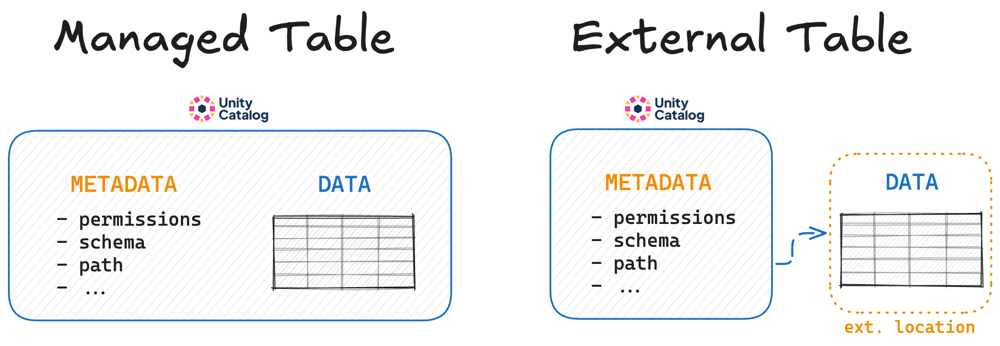
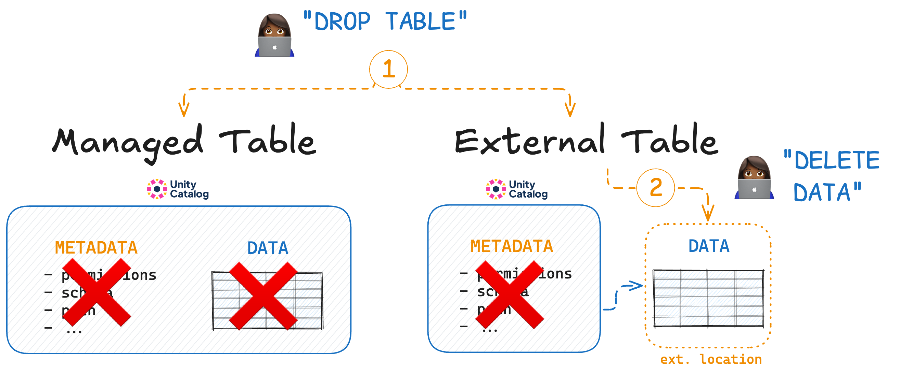

# Managed vs External Tables

Unity Catalog supports both managed and external tables.

A **managed table** is a table for which Unity Catalog manages both the metadata and the data itself, incl. creation, storage, and deletion. Data is managed at a pre-configured storage location to which Unity Catalog has full read and write access.

An **external table** is a table for which Unity Catalog manages _only_ the metadata and not the lifecycle of the underlying data itself. The user is responsible for data creation, storage and deletion at the external location.



## How to Create a Managed Table

<< code >>

## Specifying the Managed Storage Location

By default, managed tables are stored in Unity Catalog's root directory.

You can also specify locations for managed tables at the catalog or schema level. You might want to do this for stronger isolation between schemas or catalogs, e.g. between "prod" and "dev".

<< how / code >>

Unity Catalog will search for a user-defined storage location in the following order:

- at schema level
- at catalog level
- at metastore root directory, configured during setup

## How to Create an External Table

Use the `uc/bin table create` command with a `storage_location` to create an external table.

For example:

```
bin/uc table create --full_name unity.default.test_ext \
  --storage_location ~/tmp \
  --columns "id INT, name STRING" \
```

You will see `TABLE_TYPE EXTERNAL` in the returned metadata:

```
┌────────────────────┬──────────────────────────────────────────────────────────────────────────────────────────┐
│        KEY         │                                          VALUE                                           │
├────────────────────┼──────────────────────────────────────────────────────────────────────────────────────────┤
│NAME                │test_ext                                                                                  │
├────────────────────┼──────────────────────────────────────────────────────────────────────────────────────────┤
│CATALOG_NAME        │unity                                                                                     │
├────────────────────┼──────────────────────────────────────────────────────────────────────────────────────────┤
│SCHEMA_NAME         │default                                                                                   │
├────────────────────┼──────────────────────────────────────────────────────────────────────────────────────────┤
│TABLE_TYPE          │EXTERNAL                                                                                  │
├────────────────────┼──────────────────────────────────────────────────────────────────────────────────────────┤
│DATA_SOURCE_FORMAT  │DELTA                                                                                     │
├────────────────────┼──────────────────────────────────────────────────────────────────────────────────────────┤
│COLUMNS             │{"name":"id","type_text":"int","type_json":"{\"name\":\"id\",\"type\":\"integer\",\"nullab│
│                    │le\":true,\"metadata\":{}}","type_name":"INT","type_precision":0,"type_scale":0,"type_inte│
│                    │rval_type":null,"position":0,"comment":null,"nullable":true,"partition_index":null}       │
│                    │{"name":"name","type_text":"string","type_json":"{\"name\":\"name\",\"type\":\"string\",\"│
│                    │nullable\":true,\"metadata\":{}}","type_name":"STRING","type_precision":0,"type_scale":0,"│
│                    │type_interval_type":null,"position":1,"comment":null,"nullable":true,"partition_index":nul│
│                    │l}                                                                                        │
├────────────────────┼──────────────────────────────────────────────────────────────────────────────────────────┤
│STORAGE_LOCATION    │file:///Users/rpelgrim/tmp/                                                               │
├────────────────────┼──────────────────────────────────────────────────────────────────────────────────────────┤
│COMMENT             │null                                                                                      │
├────────────────────┼──────────────────────────────────────────────────────────────────────────────────────────┤
│PROPERTIES          │{}                                                                                        │
├────────────────────┼──────────────────────────────────────────────────────────────────────────────────────────┤
│CREATED_AT          │1725876982747                                                                             │
├────────────────────┼──────────────────────────────────────────────────────────────────────────────────────────┤
│UPDATED_AT          │null                                                                                      │
├────────────────────┼──────────────────────────────────────────────────────────────────────────────────────────┤
│TABLE_ID            │ad67416b-b3e1-412f-9ab3-bf6926a8ce49                                                      │
└────────────────────┴──────────────────────────────────────────────────────────────────────────────────────────┘
```

## Dropping Managed vs External Tables

When you drop a managed table from Unity Catalog, the underlying data is also removed.

When you drop an external table from Unity Catalog, the underlying data is not touched. If you want the data to be deleted, you will have to do so manually.



## When to use which table

Unity Catalog gives you the freedom to use both managed and external tables, depending on your needs.

**You may want to use managed tables when:**

- You prefer simplicity and easy data management.
- Your data lifecycle is tightly coupled with the table definition.
- You don't want to worry about the details of data storage.

**You may want to use external tables when:**

- You need to manage data storage locations explicitly.
- You require data persistence independent of table definitions.
- You need external read or write access to your data.
